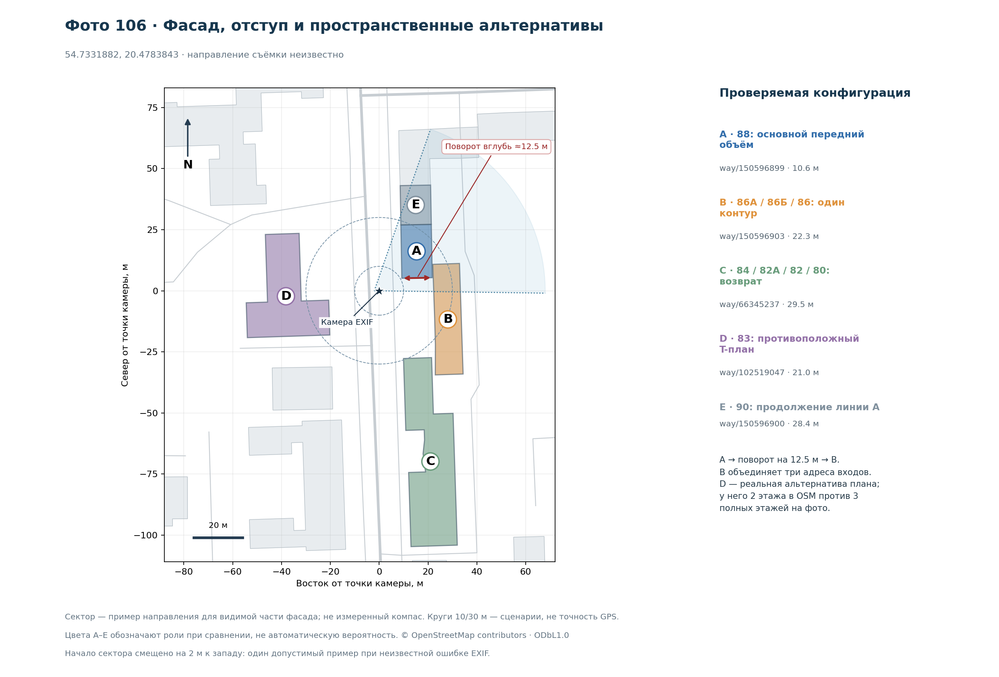

# Prussia39: проверка архитектурных описаний на всём корпусе Street Story

Дата наблюдений: **8 октября 2026 года**. Проверены ссылки 102 и 104–133. Действующее полное задание кодовому агенту: [единая постановка](../../prompts/street-story-unified-photo-search-20261008.md).

## Результат

**Гипотеза подтверждается как полезный дополнительный способ идентификации:** адресный архитектурный текст способен заменить поиск внешней фотографии, когда его индивидуальные признаки согласуются с SOURCE и объект правильно привязан. Применимость зависит и от наличия карточки, и от содержания текста. Уверенная геометрия остаётся самостоятельным достаточным способом; Prussia39 не становится обязательной стадией каждого случая.

| Что проверено | Количество |
|---|---:|
| Запрошенные Telegram-ссылки |31|
| Фотографии зданий |26|
| Другие изображения: UI-скриншоты 114–117 |4|
| Текст без изображения:113 |1|
| Оригиналы зданий с GPS |19|
| Дополнительные приблизительные точки владельца |4|
| Кадры без географической опоры:124,127,128 |3|
| Прочитанная карточка целевого объекта или проверяемой гипотезы |20 из 26|
| Различающий текст в явно указанном контексте |13|
| Сильное соответствие фасада, но нерешённый physical scope |1|
| Только поддержка/частичное соответствие |4|
| История без различающего описания экстерьера |2|
| Карточка цели не найдена в ограниченной выдаче |6|

Дополнительно прочитаны четыре другие карточки соседей как отрицательные контроли: всего 24 различных текста. Новый наружный REF не использовался для этих вердиктов. Продуктовые inference, canary и deployment не выполнялись.

**13 — число положительных ручных сопоставлений в данном контексте, не измеренная точность автоматического GPS pipeline.** Часть адресов была известна из прошлого исследования;118 и 127 использовали именные визуальные гипотезы;123 пришёл из координатной формы Prussia39; четыре случая используют owner-approximate camera. Корпус не является случайной выборкой, проверка не слепая. Здесь оценивается практическая пригодность метода, а не гарантированная доля распознавания будущих снимков.

## Протокол и категории

Все 26 SOURCE были просмотрены и сопоставлены с реально прочитанным текстом, когда он найден. У каждого результата раздельно зафиксированы исходный hash, происхождение координат, использованная гипотеза, адрес/OSM-кандидат, статья, сравнение и предел. Нельзя считать неполученное описание отрицательным визуальным совпадением.

- **A — различает в контексте.** Есть индивидуальная комбинация и согласующийся адресный/пространственный либо явно отмеченный именной контекст. Не заявляется уникальность по всему миру или независимость от географии.
- **S — physical scope не разрешён.** Хороший текст о фасаде ещё не установил конкретный корпус.
- **P — поддерживает/частично.** Текст совместим, но слишком общий, решающие детали не видны либо identity уже определяется более сильной геометрией.
- **H — история без фасада.** Источник может дать сведения после identity, но не опознаёт наружный вид.
- **N — bounded lookup gap.** Нужная карточка не найдена в проверенной выдаче. Это не доказательство её отсутствия на всём сайте.

Для 126 после отдельной повторной сверки выбран консервативный P: клинкер и положение на углу поддерживают уже надёжную геометрию, но не дают самостоятельного узкого фасадного доказательства. Переделка террасы не проверяется по одному нынешнему кадру; крупные окна не выдаются за признак, прямо описанный в статье. Прежняя идентификация здания не понижена.

## Полная матрица 26 зданий

| Фото | Объект / кандидат | Текст | Что проверено и предел |
|---|---|---|---|
| [102](https://t.me/c/4488229487/2/102) | Калининград, Житомирская, 22–24 | **A** · [карточка 3875](https://www.prussia39.ru/sight/index.php?sid=3875) | Три оси окон; центральный эркер меняет форму в верхней части. Адрес/статья были известны ранее; это проверка текста, не слепое discovery. |
| [104](https://t.me/c/4488229487/2/104) | Башня Врангель | **A** · [карточка 550](https://www.prussia39.ru/sight/index.php?sid=550) | Выступ над зубчатым верхом и повторяющийся арочный декор. География отличает от сходной башни Дона; полный кольцевой план не виден. |
| [105](https://t.me/c/4488229487/2/105) | Университетская, 3 | **N** · — | Для цели нет прочитанного текста. Пять адресных результатов не включают нужный дом; отсутствие статьи во всём сайте не доказано. |
| [106](https://t.me/c/4488229487/2/106) | Комсомольская, 88; статья о комплексе 80–90 | **A** · [карточка 2458](https://www.prussia39.ru/sight/index.php?sid=2458) | Совпадают ступенчатый торец, угловой эркер, рельефные пояса и взаимные отступы. Статья охватывает несколько домов; конкретный № 88 выбирает OSM-сцена. |
| [107](https://t.me/c/4488229487/2/107) | Комсомольская, 53–61; северный угол у № 61 | **A** · [карточка 2519](https://www.prussia39.ru/sight/index.php?sid=2519) | Башенка и эркер верхних этажей согласуются с описанием угла. Одна карточка комплекса; направление устанавливает карта. Найдена также на второй странице адресной выдачи. |
| [108](https://t.me/c/4488229487/2/108) | Генделя, 6 | **N** · — | Текст цели не найден; соседнее общежитие не подходит. Карточка Генделя, 8–16 относится к иному корпусу и другой этажности. |
| [109](https://t.me/c/4488229487/2/109) | Клиническая, 19А | **N** · — | Для цели нет прочитанного текста. Девять результатов по улице не включают точный адрес; исторический стиль не доказывает старый возраст. |
| [110](https://t.me/c/4488229487/2/110) | Багратионовск, Калининградская, 10; северный корпус | **H** · [карточка 2902](https://www.prussia39.ru/sight/index.php?sid=2902) | Прочитаны сведения об истории и использовании, без фасадных признаков. Карточка полезна после identity; общий адрес не различает соседние корпуса. |
| [111](https://t.me/c/4488229487/2/111) | Дмитрия Донского, 15 | **N** · — | Для цели нет прочитанного текста. Дальний объект не заменяется ближайшим; в 12 адресных результатах нужной карточки нет. |
| [112](https://t.me/c/4488229487/2/112) | Желябова, 9; школа Фридриха Эберта | **A** · [карточка 3014](https://www.prussia39.ru/sight/index.php?sid=3014) | Квадратная часовая башня, шпиль, отделка фасада. Две скрытые грани и полный план нельзя проверять по этому crop. |
| [118](https://t.me/c/4488229487/2/118) | Грекова, 2; бывшая дирекция почт | **A** · [карточка 1216](https://www.prussia39.ru/sight/index.php?sid=1216) | Выступающий портик, колонны и треугольный фронтон. Часть колонн закрыта; использована именная визуальная гипотеза и GPS, новый OSM ID не сохранён. |
| [119](https://t.me/c/4488229487/2/119) | Барнаульская, 6; ближайший OSM-кандидат 6А | **S** · [карточка 2538](https://www.prussia39.ru/sight/index.php?sid=2538) | Сильное соответствие низких крыльев и более высокого центрального входа. Не установлено соответствие статьи о комплексе 6 конкретному footprint6А; близость не разрешает конфликт. |
| [120](https://t.me/c/4488229487/2/120) | Барнаульская, 8; офтальмологическая клиника | **A** · [карточка 2540](https://www.prussia39.ru/sight/index.php?sid=2540) | Разновысотные объёмы, оформление окон и контрастная кладка. Полный план не виден; соседняя хирургическая клиника имеет другое распределение объёмов. |
| [121](https://t.me/c/4488229487/2/121) | Светлогорск, Октябрьская, 11А | **N** · — | Для цели нет прочитанного текста. В 19 результатах нет точной карточки 11А. Водолечебница/башня по адресу 11 не заменяет дом 11А. |
| [122](https://t.me/c/4488229487/2/122) | Светлогорск, Октябрьская, 18; Хубертус | **P** · [карточка 2849](https://www.prussia39.ru/sight/index.php?sid=2849) | Два этажа, мансарда и крытые балконы согласуются, но мало различают. Характерные детали SOURCE в тексте не описаны; соседний № 20 сохраняет отдельный scope. |
| [123](https://t.me/c/4488229487/2/123) | Сальское; кирха Святого Лауренциуса | **A** · [карточка 198](https://www.prussia39.ru/sight/index.php?sid=198) | Руина с уцелевшим кирпичным фронтоном, каменным основанием и пристройками. Найдена прямо по координатам Prussia39; первоначальная догадка о другом посёлке отвергнута. |
| [124](https://t.me/c/4488229487/2/124) | Гипотеза: храм Александра Невского | **P** · [карточка 620](https://www.prussia39.ru/sight/index.php?sid=620) | Общая типология согласуется; индивидуального описания фасада мало. GPS нет; размеры и история посвящения не опознают этот снимок. |
| [125](https://t.me/c/4488229487/2/125) | Фрунзе, комплекс 53–57; карточка 51–57 | **A** · [карточка 1361](https://www.prussia39.ru/sight/index.php?sid=1361) | Несколько связанных домов и арка согласуются с SOURCE и картой. Принят scope комплекса; номер отдельного исторического дома и tenant не установлены этим текстом. |
| [126](https://t.me/c/4488229487/2/126) | Советск; ложа «К трём патриархам» | **P** · [карточка 1095](https://www.prussia39.ru/sight/index.php?sid=1095) | Клинкер и положение на углу поддерживают готовую геометрию. Самостоятельного узкого фасадного доказательства мало. Крупные окна текстом явно не описаны; прежняя geometry identity сохранена. |
| [127](https://t.me/c/4488229487/2/127) | Гипотеза, подтверждённая текстовым набором: казармы драгунского полка | **A** · [карточка 1093](https://www.prussia39.ru/sight/index.php?sid=1093) | Парные/тройные арки, верхние стрельчатые окна, угловые колонки и портал. GPS отсутствует; город и название были поисковой гипотезой. Это не GPS→OSM успех. |
| [128](https://t.me/c/4488229487/2/128) | Гипотеза: капелла «Мария — Звезда моря» | **P** · [карточка 769](https://www.prussia39.ru/sight/index.php?sid=769) | Фахверк и крыша согласуются; описанные часы и шпиль не проверяются. GPS нет; невидимые детали не стали отрицанием, но положительного различающего набора недостаточно. |
| [129](https://t.me/c/4488229487/2/129) | Калининград, Победы, 24; вилла Шмидт | **A** · [карточка 1241](https://www.prussia39.ru/sight/index.php?sid=1241) | Материал фасада и декор над окнами согласуются в локальном пуле. Текст прямо учитывает утрату башни; target имеет ранг 6, а не 1. |
| [130](https://t.me/c/4488229487/2/130) | Советск, Гастелло, 22 | **N** · — | Для главного дома текста не найдено; прочитаны другие № 21 и № 24. Их история не перенесена на 22. Ранее принятая геометрия трёх домов сохраняется. |
| [131](https://t.me/c/4488229487/2/131) | Советск, 9 Января, 13; Дом призрения | **A** · [карточка 1110](https://www.prussia39.ru/sight/index.php?sid=1110) | Ступенчатые завершения, формы входа/окон, кирпичный фасад. Часы и зелёные детали видны, но не перечислены в тексте: не считать их текстовым совпадением. |
| [132](https://t.me/c/4488229487/2/132) | Советск, Школьная, 13; классическая гимназия | **A** · [карточка 1019](https://www.prussia39.ru/sight/index.php?sid=1019) | Центральный выступ с тремя осями и ступенчатым завершением. Есть прежняя identity и приблизительная точка владельца; улица, упирающаяся в фасад, уже даёт самостоятельную геометрию. |
| [133](https://t.me/c/4488229487/2/133) | Гипотеза: школа Отто Брауна, Черняховск, Суворова, 11 | **H** · [карточка 1135](https://www.prussia39.ru/sight/index.php?sid=1135) | Статья описывает главным образом историю и интерьеры. Отличительный наружный фасад текстом не описан. Это дальний кандидат, а не ближайшее депо. |

Сообщение 113 оказалось текстом,114–117 — четырьмя скриншотами интерфейса Projects Hub. Фактическая связь этих сообщений — тема 29 при теме 2 в присланных URL. Полученные четыре изображения являются сжатыми `Telegram.photo`, без оригинального документа и GPS. Они действительно просмотрены; не исключены по одному предположению о расширении файла. Учитываются в [аудите всех 31 ссылок](link-audit.json), но не в знаменателе 26 зданий. Сами UI-скриншоты и чужая переписка в пакет не включены.

## Что добавил именно этот проход

### 1. Адресный и координатный поиск существенно полезнее пустой внешней выдачи

Внешний поиск с `site:prussia39.ru` пропускал даже существующие карточки. Обычная форма названий также не эквивалентна поиску по адресу. Рабочими оказались публичные формы:

- [Поиск по базе](https://www.prussia39.ru/sight/database.php): GET с `text_np`, `text_adr` и полным набором исходных полей формы; кодировка параметров и HTML — Windows-1251.
- [Поиск вокруг точки](https://www.prussia39.ru/sight/map_coord.php): POST `new_coords=lat,lon`; названия и координаты карточек приходят в HTML.

Сокращённый GET с двумя полями возвращал одну форму без результатов. Полный запрос вернул нужные адресные списки. Нулевой body при HTTP200 также наблюдался: его нельзя считать отсутствующей статьёй. Разбор делает отдельные исходы для пустого списка, пустого body, нераспарсенной страницы и полноценного текста без архитектуры.

Комсомольская дала 35 результатов:20 на первой странице и 15 на второй. Карточка 53–61 есть на второй; переход использует реальную ссылку с `p=2`. Это причина проверять полноту выдачи до вывода «описание не найдено», сохраняя ограничение на число переходов.

Координатный поиск 123 вернул кирху Святого Лауренциуса и каменное изваяние. Он исправил первоначальную неверную догадку о населённом пункте. В 133 тот же механизм дал школу и соседнее депо: близость статьи помогла поиску, но не создала отсутствующее описание фасада. При дальней цели запрашивать следует поддержанную область кандидата: окно сайта ограничено.

### 2. Текст и карта могут усиливать друг друга

Самый показательный совместный пример —106. [Карточка комплекса](https://www.prussia39.ru/sight/index.php?sid=2458) описывает взаимное положение домов и характер уличных завершений. Сохранённая OSM-сцена различает физические контуры и адресные входы.



На схеме поворот объёма A в глубину составляет около 12.5 м; проекция фронта B относительно A у входа 86Б — около 13.1 м. Это разные измерения. Описанный в карточке отступ порядка 12 м согласуется с их масштабом; точного совпадения независимых измерений не заявляется. [Метрики и provenance](../20261008-spatial-proof/kaliningrad/metrics.json) сохраняют определения и исходные числа. Физический 88 выбирает сцена; статья охватывает сразу комплекс 80–90.

Для 132 описание центральной части гимназии согласуется с видимым фасадом, но [геометрия уличного коридора](../20261008-spatial-proof/gymnasium/map-132.png) уже сама объясняет выбор. Для 130 отсутствие текста главного 22 не отменяет [трёхдомную конфигурацию](../20261008-spatial-proof/sovetsk/map-130.png). В обоих случаях запрещено требовать завершения всех методов подряд.

### 3. Текст особенно полезен для тесного фасада

У 102 описание распределения окон и меняющейся формы эркера даёт проверяемую комбинацию без окружающей застройки. У 127 сочетание типов проёмов, угловых деталей и входа значительно информативнее общего слова «казармы». При этом у 127 нет GPS: результат честно относится к пути «визуальная именная гипотеза → описание», а не к восстановлению координаты.

Слова «неоготика» или «модерн» сами по себе слишком общие. Источник должен объяснять конкретное наблюдаемое устройство здания. У 122 имеющийся текст не описывает достаточно индивидуальных деталей; у 110 и 133 архитектурного материала почти нет. Наличие богатой истории не делает её визуальным доказательством.

### 4. Реставрация и адресный scope требуют явной обработки

У 129 статья прямо сообщает утрату прежней башни. Её отсутствие на нынешнем SOURCE совместимо с текстом. У 128 описанные верхние детали не проверяются по снимку: это не основание ни для уверенного отрицания, ни для выдуманной истории реставрации. Цвета, оконные рамы и кровля слабее устойчивого расположения объёмов; значительная перестройка способна изменить и геометрию.

Случай 119 показывает отдельный предел метода: описание комплекса 6 хорошо согласуется с фасадом, но ближайший OSM-кандидат 6А и контур, содержащий точку статьи 6, не были надёжно сведены в этот физический объект. Такой результат требует решения scope, а не дополнительных красивых исторических фактов.

## Изменение стратегии

1. Original/EXIF и существующий cache/POI.
2. При географической опоре — один OSM patch; рядом подготовить доступные лёгкие Wiki leads.
3. Если пространственный паттерн достаточно различает — принять geometry и перейти к сведениям.
4. Если нужен фасадный признак — один Prussia lookup по адресу или точке и 1–2 релевантных текста; сравнить с настоящим SOURCE и принять architectural_text при достаточности.
5. При оставшейся неоднозначности — одно адресное действие, способное её снять. Внешнее фото возможно, но не обязательная развилка после уже принятого proof.
6. Готовый текст переиспользовать для subject-scoped extraction/review; история учреждения и физическое здание сохраняют разный предмет.

Это адаптивная последовательность. Например, координатная форма Prussia может идти параллельно с OSM, если это быстрее и её локальная область подходит. Для ясной геометрической сцены специальный поиск описания ради identity не нужен. Единый accepted predicate открывает обычные facts и POI-memory без фиктивного `visual_reference_verified`.

## Ресурсы и пределы измерения

Настоящий проход не был минимальным runtime: пришлось исследовать публичные формы и ошибки reader. Для 104–112 использованы 18 web queries,6 адресных запросов, один переход пагинации и чтения карточек; для 102/118–125 агент зафиксировал 31 прямое HTTP-чтение, включая отладку форм. Эти расходы нельзя выдавать за «два шага на фото». Отдельные shared lookup не являются отдельным send на каждый кадр. [Сохранённые receipts и оговорённый охват](retrieval-receipts.json) показывают доступные наблюдения, а не полный биллинг всех инструментов.

Прямой адресный запрос root занял 5.324 с; два координатных — примерно 10 с; у другой группы адресные обращения занимали примерно 14–15 с, чтения карточек 6–10 с. Это наблюдения нескольких запросов, не оценка среднего/p95. Продуктовая semantic latency и получение reviewed facts здесь не измерены.

Для text fast path начальный бюджет —1 lookup,1–2 body и 1 совместное сравнение; для geometry —1 patch и 1 совместное сравнение. Нет обязательных image search, галереи и pair calls. Цель около 30 с возможна только с подходящим критическим путём и reuse; холодная последовательность медленных HTTP плюс review легко выходит за это окно. Полное время от upload и время до первого полезного факта измеряются отдельно. Согласованные hard caps3/5/8 минут сохраняются.

**Новый платный корпус из 26 кадров не требуется.** В едином задании остаётся максимум пять live-кейсов одной версии:102,104,111,130,132. Прочитанные тексты и отрицательные контроли используются для направленной проверки; исследовательские ответы не подмешиваются в обычные runtime inputs.

## Что лежит в пакете и как повторить

- [cases.json](cases.json):26 исходных hashes, координатные классы, OSM-кандидаты, первичные ссылки, grade, provenance, scope и ограничения.
- [link-audit.json](link-audit.json):честный исход всех 31 ссылок.
- [source-versions.json](source-versions.json):24 прочитанных источника,16 сохранённых raw snapshots/hashes. У 8 карточек тело было прочитано в tool output, но bytes/hash не удержаны; это отмечено `null`, не заменено хешем пересказа или поисковой страницы.
- [retrieval-receipts.json](retrieval-receipts.json):доступные HTTP receipts без cookies, полных текстов и галерей.
- [prussia_probe.py](prussia_probe.py):малый воспроизводимый клиент публичных форм, одна команда — максимум один запрос, с кешем и различением транспортных исходов.
- [verification.json](verification.json):проверка полноты набора, итоговых категорий, отсутствия REF и ограничений исследования.
- `osm/`:три новых ограниченных snapshots129/131/133 с fetch metadata. Остальные карты переиспользованы из предыдущих исследовательских пакетов. © OpenStreetMap contributors, [ODbL](https://www.openstreetmap.org/copyright).

Примеры, запускаемые только при необходимости повторения; они не загружают изображения и не вызывают модель:

```bash
python prussia_probe.py address Калининград Комсомольская
python prussia_probe.py address Калининград Комсомольская --page 2
python prussia_probe.py nearby 54.917359 20.1750208
python prussia_probe.py article 3875
```

Результат extraction проверен на существующем cache: Windows-1251, секции статьи, две координатные выдачи и адресная пагинация 35=20+15. Raw pages и чужие фотографии не опубликованы. Это исследовательский helper, не готовый production adapter; поведение текущей HTML-разметки нужно валидировать при внедрении.
