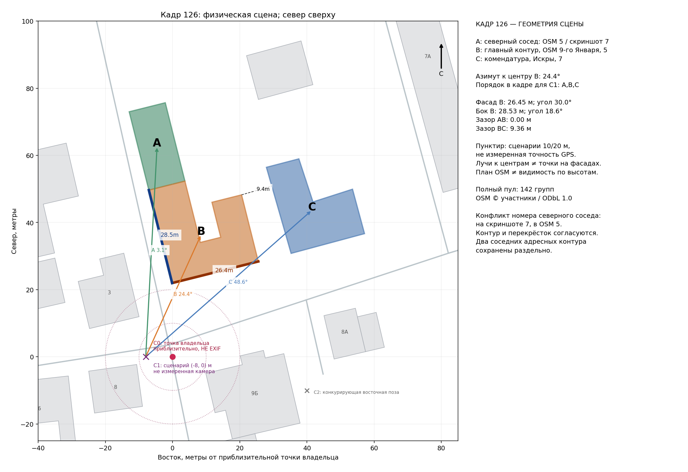
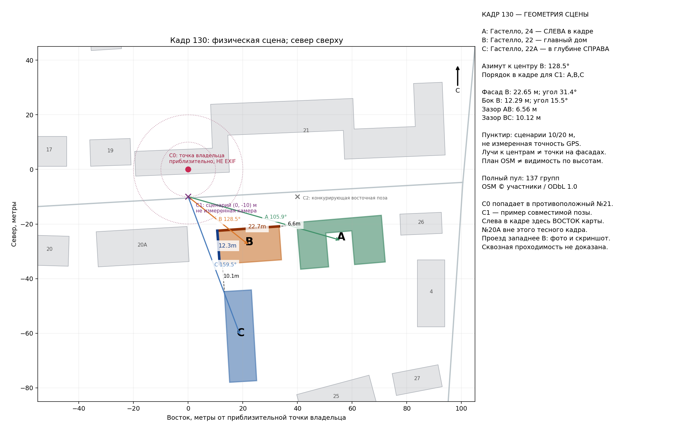

# Пространственная проверка 126 и 130, Советск

Дата: 2026-10-08. Проверены четыре предоставленных изображения: исходные кадры 126 и 130 (ориентированные превью, привязанные SHA256 к оригиналам) и скриншоты `image(20261008-193001).png`, `image(20261008-193801).png`. Оба исходных файла не содержат EXIF GPS. Координаты в этом исследовании сообщил владелец как приблизительные точки; метка дома на скриншоте не является положением камеры.

Получено ровно два OSM API snapshot: квадратные окна по 240 м в каждую сторону от каждой приблизительной точки. Повторов, внешних фотореференсов, inference и продуктовых запусков не было. Сохранены все полученные контуры: 142 группы зданий вокруг 126 и 137 вокруг 130. Целевые способы идентификации не основаны на выборе ближайшего здания.

## Итог и границы вывода

**126: физический угловой контур `way/192219449` принят по локальной геометрии сцены.** При принятой локализации перекрёстка это северо-восточное угловое здание с непосредственно примыкающим северным соседом и отдельным восточным корпусом. Название «К трём патриархам» получено от владельца и его карты; историческая принадлежность не доказана одной геометрией. Адресный конфликт не мешает физической привязке: у северного соседа на скриншоте номер 7, а OSM помечает как целевой контур, так и северный сосед номером 5 по улице 9-го Января. Нельзя автоматически объединять эти два контура в один объект истории.

**130: основной снятый дом `way/193106188`, улица Капитана Гастелло, 22, принят по локальной геометрии.** Полная сцена не равна механически прочитанной строке карты «20А—22—24». Слева в фотографии согласуется №24; в глубине справа согласуется №22А. №20А расположен значительно правее выбранного поля зрения. Физическая идентичность главного №22 определена; сопоставление частично видимых боковых объектов — сильная пространственная гипотеза, без независимой проверки их фасадов. Это не вывод о строительном или историческом единстве трёх домов.

Оба вывода условны относительно сообщённой владельцем области и наблюдаемого перекрёстка/проезда. Они достаточны для принятия физической identity главного здания без наружного REF и перехода к сведениям; это не доказательство глобальной уникальности фасада среди всех городов. Не заявляется, что перебраны все возможные положения камеры и все семантические соответствия каждого контура в скачанном окне.

## 126: угол, непрерывный северный ряд и отдельный правый корпус

Приблизительная точка владельца: **55.077788, 21.888265**. На карте отдельно показан пример совместимой позы C1: 8 м западнее C0. Это сценарий чувствительности, не восстановленная с метровой точностью камера. Смещение делает видимую западную боковую стену заметнее, что согласуется с SOURCE лучше, чем буквальная неподвижная C0.

| Роль в SOURCE | Физический контур | Геометрическое основание |
|---|---|---|
| A: светлый сосед слева | `way/192219355` | Непосредственно примыкает к B с севера; общая граница, зазор 0 м. Адрес OSM 5, скриншот 7 |
| B: главный угловой объём | `way/192219449` | U-образный контур с южным уличным фронтом 26,446 м и западной стороной 28,533 м |
| C: красный корпус справа в глубине | `way/192219447` | Самостоятельный L-образный контур восточнее; минимальный зазор до B 9,358 м; OSM Искры, 7, «Комендатура Тильзита» |

Из C1 азимуты к центрам A/B/C: **3,08° / 24,37° / 48,58°**. Это левый—средний—правый порядок в изображении; центры не являются точками соответствия на фасадах. У B обе требуемые внешние стороны обращены к камере: положительные расстояния до ориентированных плоскостей 19,40 и 12,97 м. Их угловые размеры около **30,03° и 18,63°**. Снятая западная сторона и приклеенный к ней северный ряд отличают эту сцену от одного произвольного ближайшего прямоугольника.

От номинальной C0 до ближайшей границы B **21,97 м**, ранг **4**, а не 1. Ближайшие здания по другие стороны улиц не удовлетворяют одновременно нужному сектору перекрёстка, примыкающему северному ряду и отдельному восточному корпусу. Альтернатива «главный объект — C» не сохраняет нулевой зазор с непосредственно продолжающим уличную стену соседом: B—C разделены самостоятельным промежутком, а контур C иной формы. Само наличие названия на карте не использовалось как геометрическое доказательство.

Позы существенно восточнее угла меняют видимость западной стены: для сценария C2=(40,−10) она оказывается обратной относительно камеры. В сохранённой сетке 2 м при радиусах сценария 10/20/30 м остаются соответственно **65/178/313** поз вне зданий, которые сохраняют порядок A-B-C и обращённость обеих основных стен B. Эти числа не вероятности и не оценка GPS accuracy. Некоторые выбранные лучи к центрам A и C проходят через план B; это не опровергает видимость верхних этажей или боковых фрагментов, поскольку высот нет. Карта явно не заменяет трёхмерную проверку окклюзии.

## 130: главный дом, сосед слева и корпус за ним справа

Приблизительная точка владельца: **55.074106, 21.903648**. В OSM она попадает в край противоположного дома №21. Это явная причина не обращаться с ней как с точным EXIF GPS. На карте сохранена C0, а отдельная C1=(0,−10 м) показывает совместимую уличную позу возле показанного владельцем проезда. Положение C1 не объявляется измеренным.

| Роль в SOURCE | Контур | Числа для C1 |
|---|---|---|
| A: левый частично видимый дом | `way/193106197`, Гастелло, 24 | Азимут центра 105,94°; зазор до B 6,559 м |
| B: главный жёлтый дом | `way/193106188`, Гастелло, 22 | Азимут центра 128,47°; северный фасад 22,651 м, западная боковая стена 12,285 м |
| C: серый корпус в глубине справа | `way/193106171`, Гастелло, 22А | Азимут центра 159,45°; зазор до B 10,115 м; длинная ось ориентирована преимущественно север—юг |

Фото показывает длинный фронт B и более короткую боковую стену, за которой справа остаётся проход к глубинному корпусу. Для №22 из C1 угловые размеры этих сторон **31,40° / 15,51°**, отношение **2,03**. Оба фасада обращены к камере. Лучи к центрам A и C не пересекают заполненный план B; это согласуется с боковыми фрагментами, но не доказывает точные высотные перекрытия.

От номинальной C0 до границы №22 **24,87 м**, ранг **4**. Северные фронты №20А/22/24 примерно сонаправлены. При этом №24 расположен чуть ближе к линии улицы, а №22А стоит за основным №22; последний сдвиг в глубину важнее простой последовательности адресов вдоль Гастелло. Низкая детализация OSM не содержит малые фасадные ниши и эркеры, поэтому отсутствие нарисованного центрального отступа входа не исключает №22.

Проверенные альтернативы:

- **№20А как правый близкий фон**: азимут центра около 222,32°; разница от главного №22 около 93,84°. При SOURCE с f35=24 это не соседний тесный правый фрагмент такого кадра. Это ошибка переноса порядка домов с плоской карты прямо в фотографию.
- **№20А как главный объект**: из C1 его западная сторона обращена от камеры; знаковое расстояние до её плоскости −34,36 м. Чтобы видеть соответствующий западный бок, потребовалась бы существенно другая область камеры, западнее всего длинного здания.
- **№24 как главный объект**: из той же C1 его северный длинный фасад занимает только 7,84°, а западная сторона 19,49°. Соотношение 0,40 противоположно SOURCE с доминирующим длинным фронтом. Если разрешить перемещение камеры на десятки метров в другую часть улицы, это численное исключение уже нельзя переносить без повторного расчёта; здесь его дополнительно ограничивает показанное владельцем место проезда.

Проезд западнее №22 виден на фотографии и на пользовательском скриншоте, а в данном OSM snapshot отдельная highway-линия по нему отсутствует. Между №22 и №20А остаётся зазор **10,967 м**, достаточный как геометрическое место прохода; сам по себе зазор не доказывает доступность движения. Дальнейшая сквозная проходимость, шлагбаумы и правовой режим доступа не установлены.

Для №22 при радиусах 10/20/30 м вокруг C0 сетка сохраняет **43/184/357** поз вне зданий с нужным порядком A-B-C и обращённостью двух стен. Эти счётчики лишь демонстрируют наличие совместимого диапазона; они не доказывают, что все такие позы доступны пешеходу или воспроизводят точную проекцию фотографии.

## Факты и воспроизводимость

У целевых трёхконтурных сцен нет прямых OSM-тегов `wikipedia`/`wikidata`; сетевой поиск истории в этот ограниченный проход не запускался. Следующий маршрут фактов уже однозначнее: для 126 сначала название владельца + физический контур с сохранением конфликта нумерации; для 130 главный объект Гастелло, 22 отдельно от соседей 24 и 22А. Геометрия не позволяет приписывать одному дому историю соседнего корпуса или всему ансамблю.

Запуск: `python reproduce.py`. Нужны Python и matplotlib; `geometry_core.py` — локальная копия уже применённого парсера с сохранением outer/inner и отношений. Снимки можно хранить как `photo-126.osm.gz` и `photo-130.osm.gz`: скрипт распакует их и проверит исходный SHA256. Только `--fetch` разрешает загрузить отсутствующий snapshot по сохранённому URL. По умолчанию сеть не используется.

Файлы `photo-*.fetch.json` содержат bbox, URL, исходный хеш и точку владельца. `photo-*.geometry.json` содержат полный пул, контуры и OSM-теги. `photo-*.scene.json` содержат назначение A/B/C, сценарии камеры, длины сторон, азимуты, зазоры и отрицательные альтернативы. `map-126.png` и `map-130.png` — проверенные диагностические карты, север сверху. Промежуточные `initial-*` и старые `photo-*.map.png` не являются итоговыми и не нужны для публикации.
