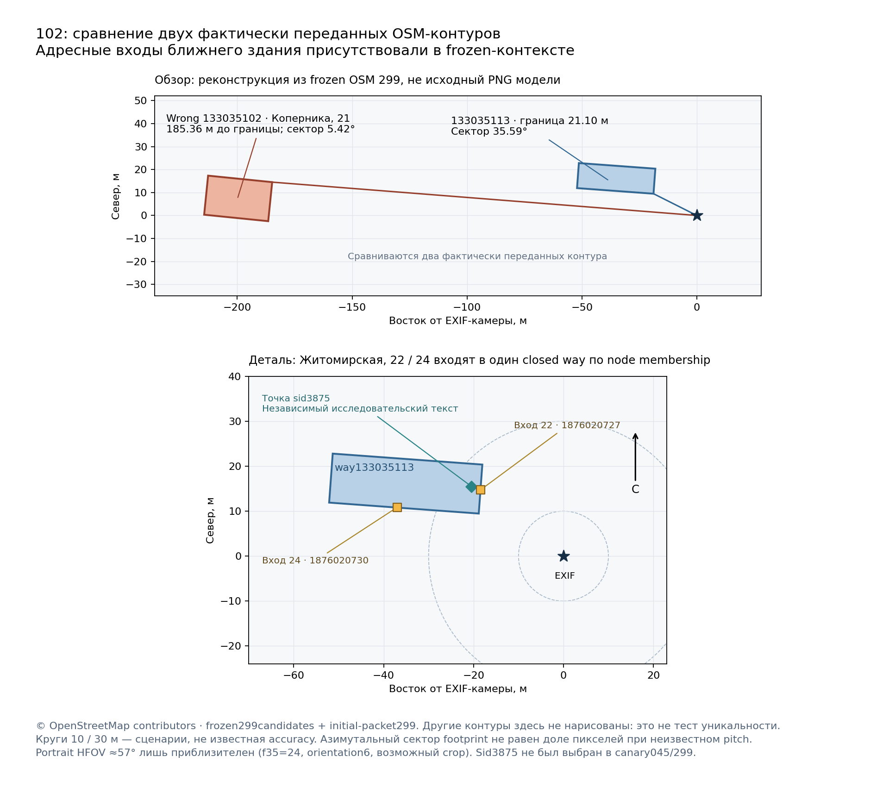

# Street Story: почему исследованный метод пока не даёт продуктовый результат

Дата проверки: 9 октября 2026 года. Проверенный код: `3a568a7bcd86073df4efe5af54b41715e3efe228`, draft [PR #246](https://github.com/onedayonemasterpiece/street-story/pull/246). Это аудит существующего решения и инструкция для следующего ограниченного исправления, а не новый запуск распознавания.

## Вывод

Проблема не сводится к квоте или необходимости ещё одного поля `compared_candidate_ids`. В фактическом входе photo102 уже были оригинальные GPS, правильный OSM-контур, его адресные входы, расстояния и угловые размеры. Но они распределены по большому кодированному пакету. Одновременно подготовленный каталог улицы **камеры** выделяет единственное другое здание с названием и адресом. Модель принимает его по общему утверждению о совпадении контура; host проверяет действительность ссылок и происхождение входов, но не получает содержательного пространственного различения.

Это совместимые с данными механизмы ошибки, а не доказанная экспериментом причинность каждого фактора. Контрольного повторного inference в этом аудите не было. Замена Lite на 3.8 ещё не проверена фактическим распознаванием.

Нужен небольшой исправленный путь: **читаемое сравнение физических объектов с уже связанными адресами → содержательное пространственное либо текстовое различение → немедленный переход к проверенным фактам**. Не нужен новый геометрический сервис, обязательный дополнительный judge или увеличение количества платных попыток.

Действующее полное задание: [единая постановка](../../prompts/street-story-unified-photo-search-20261008.md). Короткий порядок следующей работы: [комментарий кодовому агенту](../../prompts/street-story-product-unblock-20261009.md).

## 1. Что проверено независимо

Прочитана предоставленная владельцем переписка: 5 437 469 байт, 77 702 строки, SHA256 `5d1e5f01509b27408841b723bf38cdb6d29b78b6e8515e5da026896c913d07d1`. Повторяющиеся checkpoint notes не считались новыми запусками. Полная частная переписка не публикуется.

Через GitHub прочитаны 18 файлов кода и документации с проверкой Git blob SHA. Через DevCoveer непосредственно прочитаны сохранённые `product-result.json`, quota artifact, аудит Prussia045, geometry299 и выбранные поля frozen SQLite299: фактические prompt, ответ модели, manifest карты и контуры двух зданий. Запросы SQLite были `SELECT`, новых product inference и HTTP-запросов к Prussia/OSM не было. Обзорную/детальную карту воспроизводим из сохранённых векторных данных; это не оригинальный PNG, отправленный модели.

Наблюдение GitHub и серверного checkout в 05:36 UTC подтвердило head `3a568a7`, чистое дерево и ту же ветку. Health в 05:39 UTC дал HTTP200 и `source_sha=db0c0d08024441536a2e59f5c3c433b12c7f4189`. Значит, пользовательский runtime работает на прежней версии. Это подтверждает отсутствие deployment кандидата, но не объясняет неверный выбор в изолированных canary.

Проверенный `product-result.json` не заявляет PASS. Backend CI 2455 PASS / 5 skip, Android checks/emulator PASS и skipped release записаны в [validation report](https://github.com/onedayonemasterpiece/street-story/blob/3a568a7bcd86073df4efe5af54b41715e3efe228/docs/reports/product-recovery-validation-20261009.md). Эти числа в данном аудите не пересчитаны повторным CI.

Компактные первичные данные, хеши и границы выводов: [evidence.json](evidence.json). Независимая консультация Kimi K3: [статус и результат](kimi-k3.md).

## 2. Photo102: данные были, предметного сравнения не было

Исходная точка камеры: 54.710473399722225, 20.5069561, EXIF original; orientation6, 35mm-equivalent24mm, digital zoom1. Направление камеры и точность GPS неизвестны. На SOURCE виден близкий многоэтажный фасад с центральным эркером; верхняя часть эркера меняет форму. Общие карнизы и оконные перемычки не являются его наиболее различающим признаком.

| Поле фактически переданного пакета2993537 | Целевой физический объект | Ошибочно принятый объект |
|---|---|---|
| OSM ID | `osm:way:133035113` | `osm:way:133035102` |
| Нейтральная метка карты | `@381` | `@374` |
| Расстояние от камеры до границы | 21,1 м | 185,4 м |
| Азимутальный сектор всего контура | 282,9–318,5°, ширина35,6° | 269,2–274,7°, ширина5,4° |
| Адрес на footprint | Отсутствует | Коперника,21 |
| Реально связанные адреса | Житомирская,22 и24 | Прямой адрес way |
| Способ связи | Входы `1876020727` и `1876020730` входят в closed way113 | Теги самого way102 |

Оба адресных входа уже присутствовали в `address_anchors`, `building_address_memberships` и first-wave subjects с общей группой113. Поэтому ещё раз получать те же OSM адреса или объявлять EXIF потерянным — неверное направление. Следует собрать существующие связи в непосредственно читаемую строку физического кандидата, сохранив различие отдельных входов и общего footprint.

Карта воспроизведена из полученных в canary299 векторов. Отдельная точка Prussia3875 — независимое свидетельство предыдущего исследования, **не карточка, прочитанная в этих двух неуспешных canary**. Она находится внутри целевого контура. Данные карты © OpenStreetMap contributors.

Ширина5,4° для дальнего контура плохо объясняет фасад, занимающий большую часть широкоугольного кадра; правильный контур существенно ближе и занимает больший сектор. Это полезное опровержимое сравнение. Однако сектор горизонтальных азимутов не равен автоматически ширине объекта в наклонённом изображении: нужны pitch, видимая часть, возможный crop и неопределённость GPS. Поэтому здесь не вводится универсальное правило «дальше150м — исключить». Оно сломало бы, например, теле-кадр111 с настоящим объектом примерно189м от камеры.

В принятом raw response299 были:

- одна ссылка на `contour` и фраза о точном соответствии контура архитектурному объекту;
- `rejected_alternatives=[]`;
- `yaw_basis` с направлением снизу вверх — описание pitch вместо горизонтального направления;
- `sensitivity` с описанием детализации архитектуры — качество изображения вместо проверки чувствительности к положению камеры.

`freeze_geometry_proof` принимает такие непустые строки при правильных hashes и действительных references. Сохранённый replay подтверждает, что именно такой ответ проходит текущую проверку. Это доказательство корректного транспорта ответа, **не независимая проверка геометрической правильности**. Добавление списка ранее объявленных alternatives не поймает этот случай: модель объявила только выбранный дом, и необходимый список окажется пустым.

## 3. Что произошло с Prussia39

Два неуспеха необходимо разделять.

**045d802:** reverse-улица камеры Коперника стала запросом каталога. Пришла одна карточка2306, городской ломбард, Коперника21. Каталог получен на8,878с, тело статьи —20,742с; wrong physical принят примерно30с. Реально передано1046 символов текста. Цитата о лучковых перемычках и карнизах буквальна, но её совпадение с SOURCE слишком общее. В финальном ответе исчезли прежние альтернативы. Это не случай получения правильной статьи3875 с неверным присвоением её ID: была прочитана другая статья2306.

**2993537:** опять одна карточка2306 из каталога улицы камеры, но в initial packet это только metadata excerpt. Модель приняла geometry сразу, и получение тела не состоялось. Wrong accepted≈21,05с, обычный Stop≈21,90с,0фактов. Следовательно, нельзя считать этот canary проверкой архитектурного текста Prussia39.

В другом историческом запуске, bc1e660, среди двух полученных карточек уже была3875. Но возник иной отказ: модель превратила нейтральную MAP label432 в выдуманный `osm:way:432`; строгая проверка правильно отклонила ответ. Нельзя смешивать эти три случая в утверждение «правильный текст уже был и всё равно не помог».

Причинная гипотеза для299: прямой адрес и единственная именованная карточка дальнего дома получили больше внимания, чем связи безымянного ближнего контура, разнесённые по таблицам. Она поддерживается фактическими входом и ответом, но не изолирована A/B экспериментом.

Исправление поиска: reverse address камеры остаётся справкой. Для предметного каталога использовать адрес **рассматриваемого footprint или его подтверждённых входов**; при отсутствии адреса — его географическую область. `inventory_complete=true` означает полноту только данного запроса по улице, а не полноту окружающих зданий. В102 существующий вход22/24 уже позволяет один полезный lookup без нового получения OSM и без скрытого expected answer.

Независимо прочитанная ранее [карточка3875](https://www.prussia39.ru/sight/index.php?sid=3875) описывает более сильную комбинацию: три оконные оси, центральный эркер нескольких этажей, различие прямоугольной нижней и многогранной верхней частей, полукруглое завершение. Такой текст объясняет индивидуальную структуру SOURCE. Цвет после ремонта имеет меньший вес. Правильная карточка остаётся исследовательским expected evidence; SID/адрес из аудита не передаются runtime как готовый ответ.

## 4. Отдельная функциональная проблема: размер входа

Фактический initial prompt299: **91 977 символов /98 329UTF-8 байтов**, до отдельного учёта схемы и изображений. В MAP716 exact IDs, в таблицах428 observed rows,153 address anchors,35 membership links,334 first-wave rows. Это не необходимое число семантических альтернатив одного тесного фасада.

Код уже умеет lossless сжатие строк, таблиц и координат, но модель должна декодировать `$N`, `@N`, общие значения и смещения координат. Сокращение записи не устраняет объём задачи. Полный доступный OSM pool следует хранить на сервере; это не требование заново отправлять все его таблицы каждой модели.

Есть и отдельный дефект fallback. Google использует compact transport schema. Qualified text fallback получает исходную strict schema. Native проверяет лимит базы до добавления схемы. В сохранённом другом примере62 507 символов базы превращаются в110 579 адресованного входа. Live ограничивает вход24 000UTF-8 bytes и отказывает до отправки. Это конкретная ошибка подготовки входа, а не общая нехватка квоты.

Исправлять следует полный размер **после** добавления системных инструкций/схемы, с отдельным небольшим контрактом text-only discovery, которому вообще запрещено принимать SOURCE/MAP identity. Нельзя просто поднять лимит, добавить сжатые enums или ещё один reask того же большого пакета.

67 277 reported tokens последнего Lite ответа — provider total, а не измерение только prompt tokens. В историческом накопленном отчёте95 Google SDK calls и2 077 744 reported tokens — нижняя граница известных счётчиков многих версий. Денежная стоимость неизвестна; это не стоимость одной фотографии или данного аудита.

## 5. Что в оценке Grok верно и что следует изменить

| Предложение | Оценка |
|---|---|
| Wrong physical identity — главный продуктовый blocker | Да. Без правильного объекта нельзя принимать его факты. |
| Текущая3.8 не измерена, silent Lite fallback сохранять запрещённым | Да. Все шесть отказов3.8 были `not_sent`; фактический ответ дал Lite. |
| Пока известен RPD, не запускать платный корпус | Да. Прогноз reset не равен фактическому admission; «metadata available» также не доказывает квоту. |
| Достаточно обязать перечислить alternatives и reask | Нет. Пустой самозаданный набор обходит guard; заполненный список тоже не доказывает различение. Нужны читаемые данные и содержательная связь SOURCE↔геометрия/текст. |
| Не принимать семантическое решение детерминированно | Да, но расстояния, азимуты, принадлежность входов и label→ID необходимо считать/проверять кодом. Это подготовка свидетельств, а не угадывание дома. |
| Один102 → один факт → deployment | Один факт — полезная ближайшая веха. Он не заменяет полный действующий gate: для богатых102/104 минимум3 содержательных атомарных факта и остальные ограниченные canary. |
| Результат должен относиться к deployable candidate | Да. Старый104 не является PASS новой версии. Но буквальные неизменившиеся source bytes, original, OSM и диагностику можно переиспользовать при совместимых subject/source/policy версиях. |
| Deploy lag — причина неправильного isolated canary | Нет. Это отдельное расхождение runtime/checkout. До PASS развёртывание не исправит ошибочную identity. |

Полезный частичный результат уже был:104 на24bbff5 принял башню Врангеля по архитектурному тексту Wikipedia примерно31,32с и дал3 независимо проверенных атомарных факта примерно238,97с; естественное завершение242,44с. Это показывает достижимость пути identity→facts, но не устойчивость final version, не Prussia success и не выполнение30-секундной цели для фактов.

### Заключение Kimi K3

Консультация получена на `nvidia/moonshotai/kimi-k3`. После затянувшегося чтения первый ход прерван; тот же консультант завершил короткую оценку предоставленных проверенных выдержек. Он поддержал исправление адресной области каталога и критику одного лишь reask. Однако смешал каталог статей с физическим OSM-пулом, предложил необоснованный радиус по focal и обязательные две карточки. Эти части отклонены: правильный footprint уже был во входе, focal сам по себе не задаёт дальность, а достаточная geometry не требует каталога. Полный ответ и проверка этих расхождений — в [kimi-k3.md](kimi-k3.md). Это второй взгляд на свидетельства, не независимое чтение всего кода Kimi.

## 6. Минимальный следующий шаг

Сначала собрать читаемый candidate context из уже имеющихся данных, сделать содержательным contract geometry/text и устранить раздутый text fallback. Проверить это на сохранённых receipts без новых распознаваний. Не создавать второй обязательный judge, другой work или новый большой refactor.

В имеющийся joint call передавать SOURCE, читаемую карту, компактные physical candidate rows с прямыми адресными joins, масштабом/позой и явной доступностью расширения. Не обязывать geometry ждать холодный Prussia HTTP; готовый каталог использовать сразу, поздний — в существующем продолжении.

После реальной доступности configured visual role — **один cold102** на подготовленной версии. При неправильном ID обычный Stop; ожидать факты неправильного дома бессмысленно. При правильном ID пройти до первого reviewed POI fact, затем до принятого полного порога102. Только после этого104,111,130,132 на том же release candidate в пределах общего лимита пяти. Не добавлять26 новых live cases.

Сохранить caps от upload: identity≤180с, первый допустимый факт≤300с, общий≤480с.30с остаются инженерной целью, не полученным SLA. Deployment того же принятого кода — после действующей продуктовой приёмки; один owner-path smoke и health/source_sha подтверждают именно runtime.

## 7. Исправление самой постановки

Предыдущая постановка правильно разрешила geometry/text без обязательной внешней фотографии и запретила терять безымянные контуры. Но её можно было реализовать как большой набор таблиц и формальных полей, не получив предметного сравнения. Поэтому теперь явно разделены **полнота хранимых данных**, **компактность конкретного модельного решения** и **содержательная достаточность evidence**. Проверка hashes/IDs не именуется проверкой пространственной правильности.

В этом аудите продуктовый код, requirements, рабочее дерево сервера и deployment не изменялись; новые product/model canary не запускались. Единственная новая модельная задача — запрошенная владельцем независимая консультация Kimi K3; её состояние и ограничения указаны отдельно.
